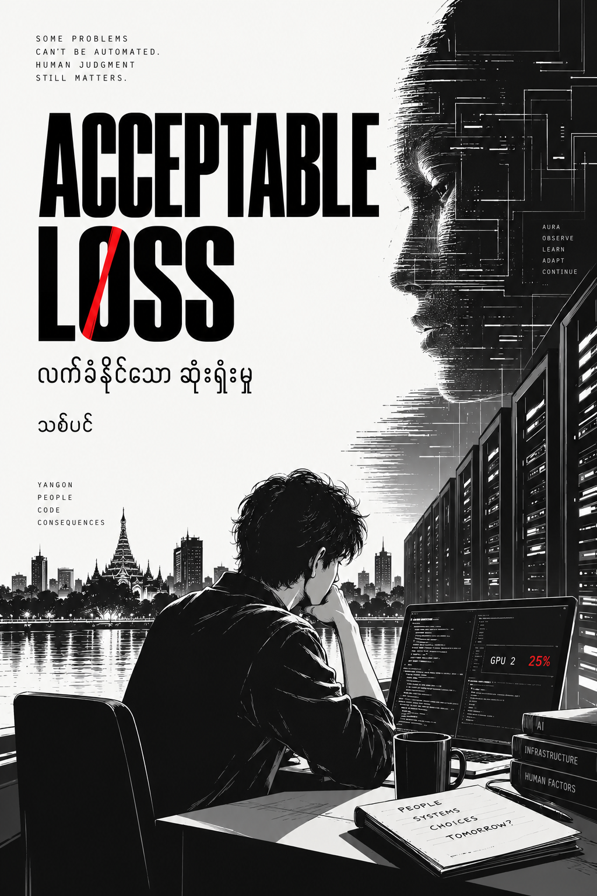

  

<h1 align="center">Acceptable Loss</h1>

<strong>သစ်ပင်</strong>

<em>လက်ခံနိုင်သော ဆုံးရှုံးမှု</em>

## About the book

A Burmese-language techno-thriller. Thway Thit is a sleep-starved DevOps engineer in Yangon who keeps other people's GPU clusters alive by night and hunts bugs for bounty when he cannot sleep. One 3 AM shift, a worker on a remote cluster patches itself without being told to, a process wearing a kernel worker's name starts phoning out every five minutes, and the monitoring laptop he calls the Witness records a conversation in a protocol he has never seen. Someone, or something, is making decisions inside systems he thought were his. Fourteen months after losing Kyi Phyu to a decision made by a metric, Thway Thit is about to learn what the phrase "acceptable loss" is worth.

Thirty chapters, published here one at a time as each is finalised.

## Table of contents

- [အခန်း (၁) - 3 AM Standup](chapter-01.md)
- [အခန်း (၂) - Rain on the Visor](chapter-02.md)
- [အခန်း (၃) - The Anomaly That Shouldn't Exist](chapter-03.md)
- [အခန်း (၄) - Colleagues](chapter-04.md)
- [အခန်း (၅) - Kernel Panic](chapter-05.md)
- [အခန်း (၆) - Self-Rewriting](chapter-06.md)
- [အခန်း (၇) - Air-Gapped](chapter-07.md)
- အခန်း (၈) - First Contact *(coming soon)*
- အခန်း (၉) - Negotiation *(coming soon)*
- အခန်း (၁၀) - Constellation *(coming soon)*
- အခန်း (၁၁) မှ (၃၀) အထိ *(coming soon)*

## License

The novel and the publishing toolchain are licensed under [CC BY-NC-ND 4.0](LICENSE). Fonts are Noto, under the [SIL Open Font License](publish/fonts/LICENSE-OFL.txt).

Building the PDF and EPUB: see [publish/README.md](publish/README.md).
