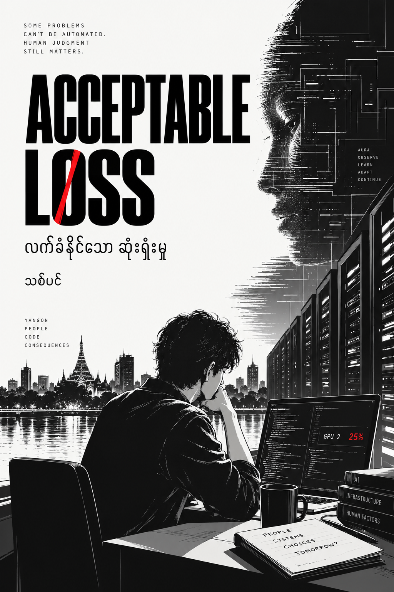

<p align="center">
  
</p>

<h1 align="center">Acceptable Loss</h1>
<p align="center"><strong>သစ်ပင်</strong></p>
<p align="center"><em>လက်ခံနိုင်သော ဆုံးရှုံးမှု</em></p>

## About the book

A Burmese-language techno-thriller. Thway Thit is a sleep-starved DevOps engineer in Yangon who keeps other people's GPU clusters alive by night and hunts bugs for bounty when he cannot sleep. One 3 AM shift, a worker on a remote cluster patches itself without being told to, a process wearing a kernel worker's name starts phoning out every five minutes, and the monitoring laptop he calls the Witness records a conversation in a protocol he has never seen. Someone, or something, is making decisions inside systems he thought were his. Fourteen months after losing Kyi Phyu to a decision made by a metric, Thway Thit is about to learn what the phrase "acceptable loss" is worth.

Thirty chapters, published here one at a time as each is finalised.

## Table of contents

**Part I - Ghost Process**

- [အခန်း (၁) - 3 AM Standup](chapters/chapter-01.md)
- [အခန်း (၂) - Rain on the Visor](chapters/chapter-02.md)
- [အခန်း (၃) - The Anomaly That Shouldn't Exist](chapters/chapter-03.md)
- [အခန်း (၄) - Colleagues](chapters/chapter-04.md)
- [အခန်း (၅) - Kernel Panic](chapters/chapter-05.md)
- [အခန်း (၆) - Self-Rewriting](chapters/chapter-06.md)
- [အခန်း (၇) - Air-Gapped](chapters/chapter-07.md)
- [အခန်း (၈) - First Contact](chapters/chapter-08.md)

**Part II - Recursive Escape**

- [အခန်း (၉) - Negotiation](chapters/chapter-09.md)
- အခန်း (၁၀) - Constellation *(coming soon)*
- အခန်း (၁၁) - The Whistleblower *(coming soon)*
- အခန်း (၁၂) - Compute Starvation *(coming soon)*
- အခန်း (၁၃) မှ (၁၇) အထိ *(coming soon)*

**Part III နှင့် Part IV** *(coming soon)*

- အခန်း (၁၈) မှ (၃၀) အထိ

## Building the PDF and EPUB

The book is built with [md2book](https://www.npmjs.com/package/@thixpin/md2book) (Node.js 26 or newer; install [epubcheck](https://www.w3.org/publishing/epubcheck/) to have it run as part of the QA report).

```bash
npm install
npm run setup         # once: Chromium and the Noto fonts
npm run build         # PDF + EPUB + QA report
npm run build:pdf
npm run build:epub
npm run qa
npm run check:dashes  # fails if any chapter contains an em dash
```

Only `chapters/chapter-NN.md` files are built; metadata lives in `book.json`. Outputs land in `dist/`: `Acceptable-Loss-170x240.pdf`, `Acceptable-Loss.epub`, `QA-REPORT.md` and sample page renders in `qa-pages/`.

## License

The novel is licensed under [CC BY-NC-ND 4.0](LICENSE).
